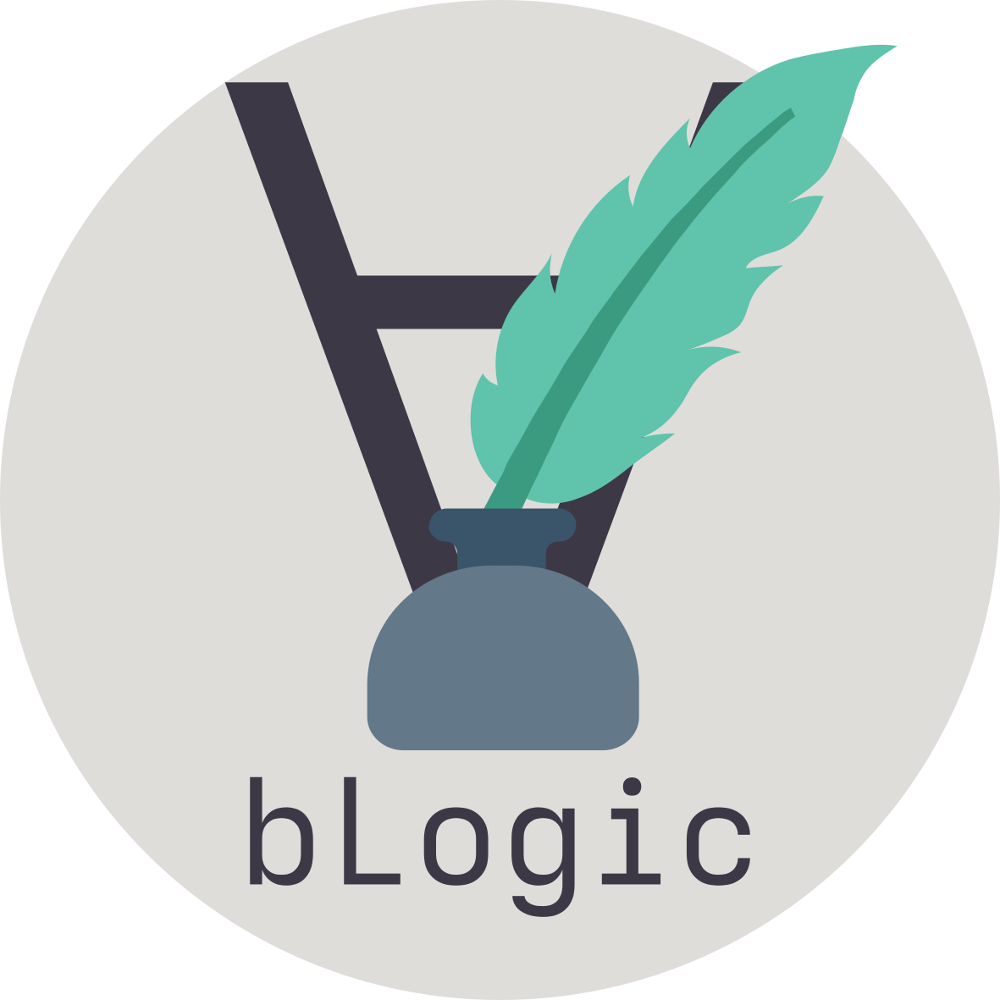

<h1 style="border-bottom:none;">bLogic.ink</h1>

This is the source repository for the [bLogic.ink](https://bLogic.ink) web blog.

This blog is built using [Hugo](https://gohugo.io/), and the theme [Hugo theme Stack](https://github.com/CaiJimmy/hugo-theme-stack).

## Get started

To run this web blog on your local machine. **You need to install Git, Go and Hugo extended locally.**
Clone the project, and in the root simply run `hugo serve`.

## Animations

To create animations for a post, create a directory inside the post directory named `animations` and with a subdir for each animation.
Each animation subdir contains `.smte` file for specifying the animation and (optionally) `scr` dir with needed image sources (best svg).

The overall structure looks as:
```
posts
├─ post_1
    ├─ animations
        ├─ my_animation_1
            ├─ src
                ├─ img1.svg
                └─ img2.svg
            └─ my_animation_1.smte
        ├─ my_animation_2
        └─ my_animation_n
    ├─ index.md
    └─ ...
├─ post_2
└─ post_3
```

Add helper script to the path: `export PATH="$PWD/bin:$PATH"`

Next navigate to the source of `.smte` file and run `make_webm.sh`; for example:
```
cd posts/post_1/animations/my_animation_1
make_webm.sh my_animation_1.smte
```

To include such generated `webm` in your post use `webm` shortcodes; for example add the following to the `posts/post_1/index.md`:

```

```

## Deploy

Simply push to the `main` branch.

## Update theme manually

Run:

```bash
hugo mod get -u github.com/CaiJimmy/hugo-theme-stack/v3
hugo mod tidy
```

> This starter template has been configured with `v3` version of theme. Due to the limitation of Go module, once the `v4` or up version of theme is released, you need to update the theme manually. (Modifying `config/module.toml` file)
