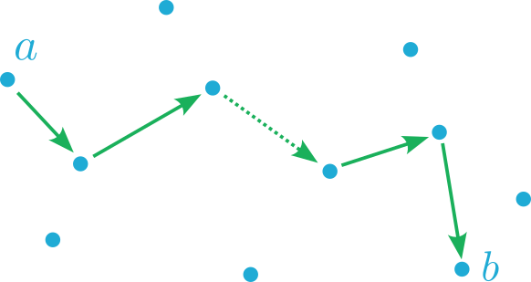
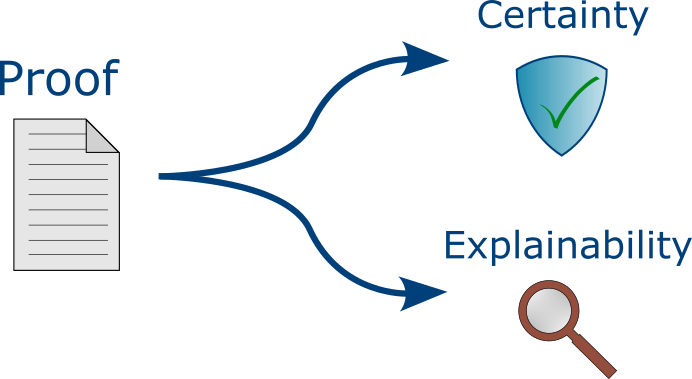
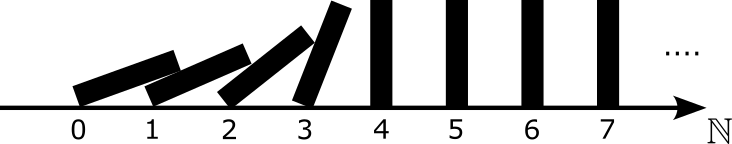

At the 17th International Conference on Logic Programming and Non-Monotonic Reasoning ([LPNMR 2024](https://lpnmr2024.demacs.unical.it/)), the paper titled [*A Sequent Calculus for Generalized Inductive Definitions*](https://link.springer.com/chapter/10.1007/978-3-031-74209-5_3) by Robbe Van den Eede, Robbe Van Biervliet, and Marc Denecker won the [Best Paper Award](https://ai.kuleuven.be/news/robbe-van-den-eede-wins-best-paper-award-at-lpnmr-2024). For [bLogic.ink](/), Robbe Van den Eede contributed an article that provides an accessible explanation of the paper.

## What is the paper about?

We have introduced a **formal proof system** to reason in a logic that extends classical logic with a very **general notion of inductive definition**, covering not only the standard monotone inductive definitions but also inductive definitions over a well-founded order and iterated inductive definitions. The proof system is a so-called **sequent calculus**, which is a certain style of proof system developed by Gentzen. In a sequent calculus, proofs take the form of **trees** consisting of **sequents**, which are essentially implications. Sequent calculi are a popular style of proof systems because they offer a systematic approach to prove statements and are theoretically elegant.

## Why it is important?

Many of the most fundamental objects in mathematics are defined constructively through **inductive definitions**. Therefore, inductive definitions have received a lot of attention in mathematical logic. A few simple examples of inductive definitions in mathematics are included below:

>*Example.* The **natural numbers** can be defined as follows:
>- $0$ is a natural number;
>- $x+1$ is a natural number if $x$ is a natural number.

>*Example.* The **even numbers** can be defined as follows:
>- $0$ is an even number;
>- $x+1$ is an even number if $x$ is not an even number.

>*Example.* Let $G$ be a graph with node set $V$ and edge set $E$. The **transitive closure** $T$ of $G$ can be defined as follows. For all $x,y \in V$:
>- $(x,y) \in T$ if $(x,y) \in E$;
>- $(x,y) \in T$ if there exists a $z \in V$ such that $(x,z) \in T$ and $(z,y) \in T$.

>*Example.* The **satisfaction relation** $\models$ in propositional logic is a binary relation between structures $\mathcal{I}$ (seen as sets of propositional constants) and propositional formulas $\varphi$. It is defined as follows:
>- $\mathcal{I} \models p$ if $p \in \mathcal{I}$;
>- $\mathcal{I} \models \varphi \land \psi$ if $\mathcal{I} \models \varphi$ and $\mathcal{I} \models \psi$;
>- $\mathcal{I} \models \lnot \varphi$ if $\mathcal{I} \not\models \varphi$.

Inductive definitions consist of **rules that dictate how to construct the defined object**. Repeatedly applying these rules (possibly an infinite number of times) results in the defined object. Inductive definitions appear in various forms. For instance, the definitions of the natural numbers and the transitive closure of a graph are **monotone**, as they add objects to the defined set based on the **presence** of other objects in the set. This is not the case for the definitions of the even numbers and the satisfaction relation. For instance, the fact that $2$ is an even number is derived from the fact that $1$ is *not* an even number. For these definitions, one must be careful not to apply rules prematurely. One may only derive that $x+1$ is even once it is certain that $x$ is not even, since otherwise one could derive that $1$ is even, for instance. To guarantee a safe rule application, one should follow the *well-founded order* (an order is *well-founded* if it has no infinite descending chains) imposed by the definitional rules. For the even number definition, this well-founded order is the natural order on the natural numbers, and for the satisfaction relation, this is the subformula order on propositional formulas. The transitive closure definition does not impose a well-founded order on its elements.

Inductive definitions thus appear in **different forms**, such as monotone inductive definitions, inductive definitions over a well-founded order and so-called iterated inductive definitions. A uniform formalisation of all these kinds of inductive definitions and the underlying construction processes is provided by the logic **FO(ID)**. FO(ID) is an extension of classical first-order logic with a syntactic construct to express inductive definitions in an intuitive rule-based format. More specifically, inductive definitions are represented in FO(ID) as sets of *definitional rules*. These are expressions of the form 
\[\forall \bar{x}: P(\bar{t}) \leftarrow \varphi ,\]
where $\bar{x}$ is a tuple of variables, $P(\bar{t})$ an atom called the *head* of the rule, and $\varphi$ a first-order formula called the *body* of the rule. The natural language definitions from before can be formalised in FO(ID) as follows:

>*Example.* The natural numbers can be defined as a unary predicate $N$ by the following definition in FO(ID):
>\[ \left\{ \begin{array}{l} 
        N(0)\\ 
        \forall x: N(x+1) \leftarrow N(x) 
    \end{array} \right\}
\]    

>*Example.* The even numbers can be defined as a unary predicate $E$ by the following definition in FO(ID):
>\[ \left\{ \begin{array}{l} 
        E(0)\\ 
        \forall x: E(x+1) \leftarrow \lnot E(x) 
    \end{array} \right\} 
\]    

>*Example.* The transitive closure of a graph $G = (V,E)$ can be defined as a binary predicate $T$ by the following definition in FO(ID):
>\[ \left\{ \begin{array}{l}
        \forall x,y: T(x,y) \leftarrow E(x,y)\\
        \forall x,y: T(x,y) \leftarrow \exists z: T(x,z) \land T(z,y)
    \end{array} \right\}
\]    
>Here we assume the universe to be the node set $V$.

>*Example.* The satisfaction relation can be defined as a binary predicate $\mathit{Sat}$ by the following definition in FO(ID):
>\[ \left\{ \begin{array}{l}
        \forall i, f: \mathit{Sat}(i,p) \leftarrow \mathit{Member}(p,i)\\
        \forall i, f, g: \mathit{Sat}(i, and(f,g)) \leftarrow \mathit{Sat}(i, f) \land \mathit{Sat}(i, g)\\
        \forall i, f: \mathit{Sat}(i, not(f)) \leftarrow \lnot \mathit{Sat}(i, f)
    \end{array} \right\}
\]
>Here the variable $i$ represents a structure and the variables $f$ and $g$ represent formulas. The predicate $\mathit{Member}/2$ represents the element relation $\in$, and the (constructor) functions $and/2$ and $not/1$ send formulas to their conjunctions and negations respectively.

The inductive definition format of FO(ID) was inspired by the formalism of **logic programming**, a computational logic based on rules with negation in the body. In fact, some have even pointed to inductive definitions as a declarative *foundation* of logical and functional programming languages. 

The constructive kind of information behind inductive definitions is not only of importance in mathematics, but also in broad applications of formal specification languages and declarative programming languages. In the field of **Knowledge Representation and Reasoning**, people think about good formal languages to specify information, and how these specifications can be used to solve problems. In the early days of Artificial Intelligence, the traditional knowledge representation language was first-order logic. However, first-order logic has some serious limitations when it comes to its expressivity. Strikingly, first-order logic is incapable of expressing some elementary notions such as the set of natural numbers and the transitive closure of a graph. To enhance the expressivity of a logic, one can add additional language constructs to the logic. One powerful language construct in this regard is that of **inductive definitions**. Besides mathematical structures, inductive definitions can be used to model various kinds of complex systems. Two examples are listed below.

>*Example.* Consider a graph in which edges can be 'activated' at each time point. Once activated, an edge remains active until a path of active edges emerges from a fixed node $a$ to a fixed node $b$. If this happens, all edges become inactive again. The state of the active edges can be modeled by defining a predicate $\mathit{Active}/3$, together with an auxiliary predicate $\mathit{ActivePath}/3$, in terms of a predicate $\mathit{MakeActive}/3$, as follows:
\[ \left\{ \begin{array}{l}
		\forall n,m,t: \mathit{Active}(n,m,t+1) \leftarrow \mathit{MakeActive}(n,m,t) \land \lnot \mathit{ActivePath}(a,b,t)\\
		\forall n,m,t: \mathit{Active}(n,m,t+1) \leftarrow \mathit{Active}(n,m,t) \land \lnot \mathit{ActivePath}(a,b,t)\\
		\forall n,m,t: \mathit{ActivePath}(n,m,t) \leftarrow \mathit{Active}(n,m,t)\\
		\forall n,m,p,t: \mathit{ActivePath}(n,p,t) \leftarrow \mathit{ActivePath}(n,m,t) \land \mathit{ActivePath}(m,p,t)
	\end{array} \right\}
\]
> Here the variables $n$, $m$ and $p$ represent nodes of the graph, and $t$ represents a time point (interpreted as a natural number). The predicates should be read as follows: An atom of the form $\mathit{MakeActive}(n,m,t)$ expresses that the edge $(n,m)$ is activated at time point $t$. The value of this predicate is given. An atom of the form $\mathit{Active}(n,m,t+1)$ expresses that the edge $(n,m)$ is active at time point $t$, and an atom of the form $\mathit{ActivePath}(n,m,t)$ expresses that there is a path of active edges from node $n$ to node $m$ at time point $t$. The value of these predicates are determined by the value of $\mathit{MakeActive}$. Through variations, this abstract example can be converted into real-world examples, such as the creation of electric circuits that burn through once a short circuit has been formed, or the construction of towers that collapse after a threshold height/weight has been exceeded.

>*Example.* Consider a system in which users may or may not have access to a certain file. A user has access if it is the owner $o$, or if it is granted access by a user with access, but not blocked by a user with access. This scenario can be modeled by an FO(ID) definition of a predicate $\mathit{Access}/1$, in terms of predicates $\mathit{Grants}/2$ and $\mathit{Blocks}/2$:
>\[ \left\{ \begin{array}{l}
		\mathit{Access}(o)\\
		\forall u : \mathit{Access}(u) \leftarrow \exists v (\mathit{Access}(v) \land \mathit{Grants}(v,u)) \land \lnot \exists v (\mathit{Access}(v) \land \mathit{Blocks}(v,u))
	\end{array} \right\}
\]

Already quite some proof systems have been developed for inductive definitions. However, **none of these proof systems cover inductive definitions as generally as FO(ID)**. Negation in a definition, if allowed at all, is only allowed in a *stratified* way. This means that one can assign a **level** $\ell(Q) \in \mathbb{N}$ to every predicate $Q$ in the definition such that for every definitional rule $\forall \bar{x}: P(\bar{t}) \leftarrow \varphi$ and any predicate $Q$ in $\varphi$, $\ell(P) \geq \ell(Q)$, and furthermore $\ell(P) > \ell(Q)$ if $Q$ appears negatively in $\varphi$. 

Stratification excludes a lot of interesting and useful definitions. For example, the even number definition is not stratified, as there is no level $\ell(E) \in \mathbb{N}$ for $E$ such that $\ell(E) > \ell(E)$.\footnote{It is still possible to define the even numbers in the existing frameworks via a positive definition (i.e., without negation), for instance by replacing the second rule by $\forall x:E(x+2)\leftarrow E(x)$. However, this is not does not work for any non-stratified definition.} For the same reason, the definitions of the satisfaction relation, the active edges, and the access relation are not stratified and hence not allowed in the existing frameworks.

The reason why the existing frameworks impose stratification on their definitions is because, if one is not careful, such uncontrolled negative dependencies may result in 'bad' definitions. For instance, the definition
\[\left\{ \begin{array}{l}
        P \leftarrow \lnot P
    \end{array} \right\}
\]
cannot attribute a truth value (true or false) to $P$, as this truth value would contradict itself. The stratification condition guarantees that definitions are always ‘good’, in the sense that they always lead to well-constructed objects. Nevertheless, there are a lot of interesting non-stratified definitions that still lead to well-constructed objects. Furthermore, one may argue that even 'bad' definitions such as $\defin{ P \leftarrow \lnot P}$ are interesting in their own right, as they can be linked to **philosophical paradoxes**. In fact, this very definition can be seen as a formalisation of the well-known **liar paradox**, which is the sentence “This sentence is false”, by viewing $P$ as the truth value of the sentence. Our work fills a gap in the scientific literature by providing a **formal proof system that can reason about these general non-stratified definitions**. 

FO(ID) thus allows us to represent very **rich kinds of information** that range from mathematical structures to logical programs, complex dynamical systems and even philosophical paradoxes. Strikingly, it reveals connections between multiple scientific disciplines that appear unrelated at first sight. The sequent calculus that we introduced for FO(ID) enables us to produce **formal proofs** about **general inductive definitions** and the rich kinds of information that can be captured with them. 

**Proofs** are very special objects, as they establish with **absolute certainty that a theorem is correct** and, moreover, they **explain in detail why the theorem is correct**. Formal proof systems serve as the basis of **proof assistants**, which are computer tools that can verify the correctness of proofs, and that can help humans in finding new proofs. On one side, these proof assistants are used by mathematicians to formalise their complicated pen-and-paper proofs and to check that they are in fact correct, or even to aid them in proving new theorems. On another side, proof assistants are used in the **formal verification** of software and hardware systems. 

Another use of proof systems lies in **proof logging**, which is a technique used in combinatorial solvers to produce, alongside the output to a given problem, a proof that this output is correct. The generated proof is then verified by a separate *proof checker*, after which the correctness of the produced output is guaranteed. The importance of proof logging grows with the progress in solver technology. This progress makes solvers more efficient, but also more complicated, which sometimes results in the production of faulty outputs. Our proof system can be used to implement proof logging as well as a proof checker for solvers that use (non-stratified) inductive definitions, such as [MinisatID](https://wms.cs.kuleuven.be/dtai/pages/software/minisatid).

## How it's done?

To obtain our proof system for general inductive definitions, we extended an existing proof system for inductive definitions by Brotherston and Simpson, based on the principle of **mathematical induction**. By mathematical induction, we mean a proof technique that is commonly taught in secondary school to prove theorems about the natural numbers. In it simplest form, mathematical induction for the natural numbers says the following: to prove that a certain property $P$ holds for every natural number $n$, it suffices to prove that the property holds for $0$ (the **base case**), and that if the property holds for a given number $x$, it also holds for $x+1$ (the **induction step**). In a formal proof system, this proof technique corresponds to the following **inference rule**:
\[
    \begin{array}{c}
        P(0) \qquad
        P(x) \Rightarrow P(x+1) \\
        \hline
        N(n) \Rightarrow P(n)
    \end{array}
\]
The formulas above the line are called the **premises**, and the formula below the line is called the **conclusion** of the rule. The inference rule says that if the base case and the induction step for $P$ (the premises) hold, then any natural number $n$ has property $P$ (the conclusion). Note that the premises of this inference rule are similar to the rules in the definition of the natural number predicate $N$ above. This is no coincidence. An alternative way of interpreting the natural number definition is by seeing $N$ as the **smallest** set that satisfies its defining rules. The inference rule above can also be read as saying that if $P$ is a set that satisfies the defining rules of $N$, then $N$ must be a subset of $P$.

Sometimes the above method does not suffice, as it may be necessary to **strengthen the induction hypothesis**. For example, the following result cannot be proven with the above method:

> *Fact.* For every natural number $n$, the sum of the first $n$ odd numbers is a perfect square.\footnote{A *perfect square* is a number that is equal to the square $m^2$ of a natural number $m$.}

We can, however, use the above method to prove the following **stronger** result:

> *Fact.* For every natural number $n$, the sum of the first $n$ odd numbers is equal to $n^2$.

Thus, to prove a certain property $P$ of the natural numbers, one generally needs to find another property for which the method of mathematical induction works and which implies $P$. This stronger property is called the **induction hypothesis**. There is no general method to find a suitable induction hypothesis, so applying this proof technique usually requires some creativity. Letting $F$ denote the induction hypothesis, this proof technique corresponds to the following inference rule:

\[
    \begin{array}{c}
		F(0) \qquad
        F(x) \Rightarrow F(x+1) \qquad
        F(n) \Rightarrow P(n) \\
		\hline
        N(n) \Rightarrow P(n)
    \end{array}
\]

The above proof method does not only work for the natural numbers, but in fact for **any** object that can be defined inductively, or at least through a positive definition (i.e., without negation). The proof system of Brotherston and Simpson does not support definitions with negation, which is very restrictive compared to FO(ID). Adding negation to definitions makes things significantly trickier. As an example, consider the following definition of the odd number predicate $O$:
\[ \left\{ \begin{array}{l}
        \forall x: O(x+1) \leftarrow \lnot O(x)
    \end{array} \right\}
\]
It differs from the even number definition in that it does not have a rule saying that $0$ is odd. If we were to straightforwardly extend the inference rule we had for the natural numbers to this definition, it would look as follows:
\[
	\begin{array}{c}
        \lnot F(x) \Rightarrow F(x+1) \qquad
        F(n) \Rightarrow P(n) \\
        \hline
		O(n) \Rightarrow P(n)
	\end{array}
\]
The left premise says that the induction hypothesis $F$ satisfies the defining rule of $O$, and the right premise says that it implies the property $P$ that we want to prove for the odd numbers. This is not a good inference rule, however, as it is **not sound**, meaning that it can **derive false statements**! For instance, letting $F$ and $P$ be the even number predicate $E$, we could derive that any odd number is also an even number, which is of course wrong. The underlying reason is that an induction hypothesis generally holds for **more** objects than those contained in the defined predicate. Hence, the negation of an induction hypothesis generally holds for **less** objects than those not contained in the defined predicate. Therefore, the negation of an induction hypothesis is too strong of an assumption for non-members of the defined predicate.

Our solution to this problem is surprisingly easy. We simply replace the formula $\lnot F(x)$ in the left premise by the formula $\lnot O(x)$:
\[
	\begin{array}{c}
        \lnot O(x) \Rightarrow F(x+1) \qquad
        F(n) \Rightarrow P(n) \\
        \hline
		O(n) \Rightarrow P(n)
	\end{array}
\]
As a recapitulation, $O$ represents the inductively defined concept in this example, $P$ is a property to be proven about the inductively defined concept $O$, and $F$ is the induction hypothesis, a property that should imply $P$. This inference rule allows us to prove all kinds of properties of odd numbers, such as the fact that every odd number is the successor (or predecessor) of an even number, for example.

Our solution may seem na\"ive, but we have shown that this proof technique is sound for general non-stratified definitions, and it appears strong enough to prove many theorems about non-stratified definitions.

## What next?

So far, we have only presented the proof system itself, applied it to a few examples of non-stratified definitions, and shown that it is sound. Soundness is a minimal property for a proof system to have, as it means that its inference rules can only derive true statements. A first direction for further research is therefore to **show extra theoretical properties that give further insight into the system**, e.g., in how powerful the system is. 

A second idea would be to **develop a cyclic proof system for non-stratified definitions**, extending another proof system by Brotherston and Simpson. In a **cyclic proof system**, proofs no longer take the form of trees but of general graphs, which may contain cycles. This makes the structure of proofs more complex, but it trades off against the complexity of the inference rules themselves. In particular, **cyclic proofs can circumvent the principle of mathematical induction** and therefore, it is no longer necessary to creatively guess a good induction hypothesis.

Third, we can **extend the obtained proof system to a more powerful system** that can reason about even more complex information by **incorporating additional language constructs**, such as partial functions, modal operators, aggregates, etc. 

Finally, our sequent calculus can be used as the basis of a **proof assistant** that can aid humans in proving theorems about general inductive definitions, and it can be used to extend combinatorial solvers that use inductive definitions such as MinisatID with **proof logging** algorithms.

In conclusion, even though there are still multiple interesting research tasks, we have at least **established a promising framework for doing formal proofs about general inductive definitions**.