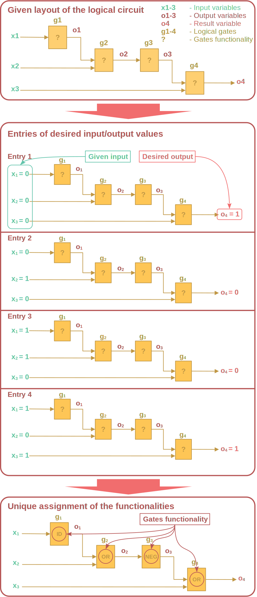
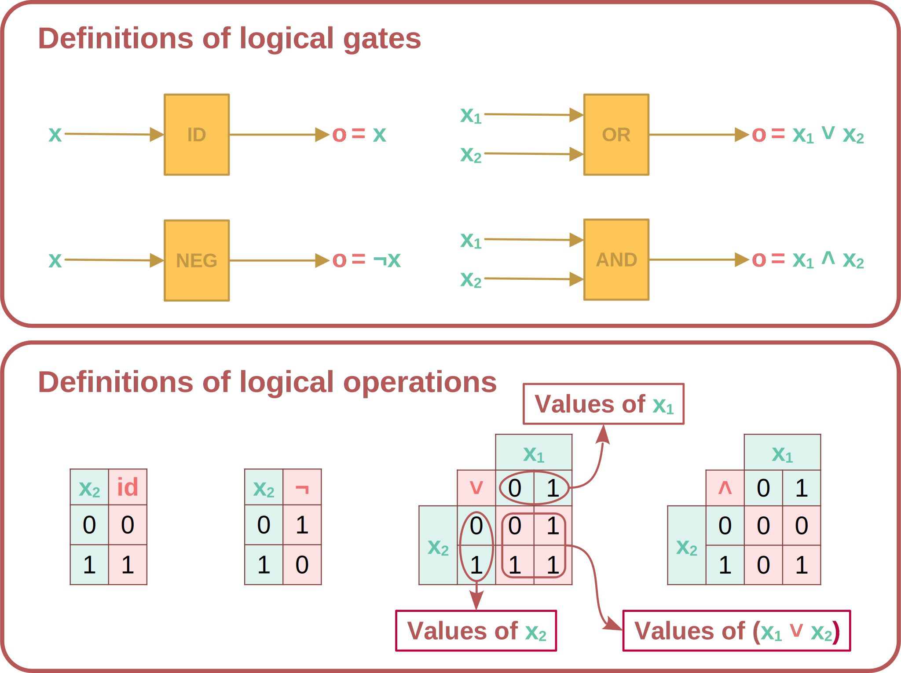
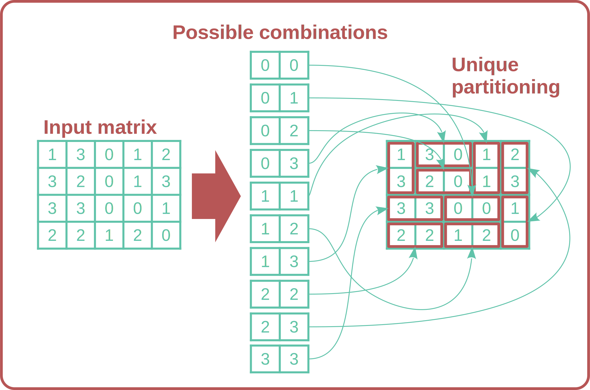
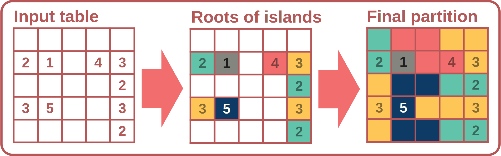
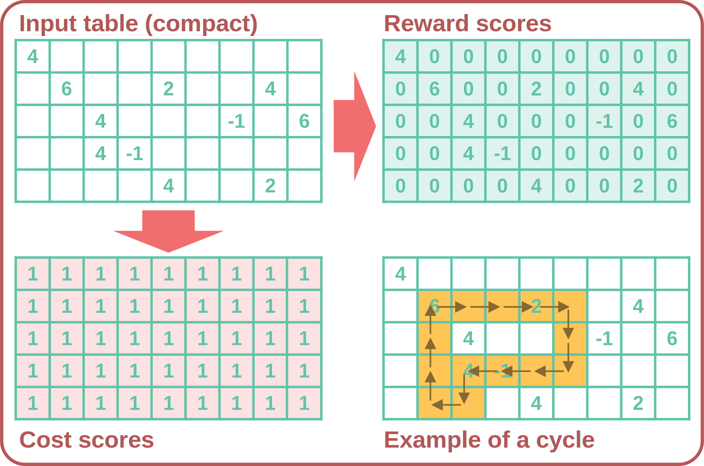

## Introduction

This post aims to present, analyze, and solve the four challenges from the programming contest held at the International Conference on Logic Programming (2024).
Short specifications of the problems are elaborated on and accompanied by graphical visualizations for better understanding.
The solutions of the challenges will be presented in two formalisms: [IDP](https://dtai.cs.kuleuven.be/pages/software/idp) (scientific paper[^1], technical manual[^2]), and [Answer Set Programming (ASP)](https://en.wikipedia.org/wiki/Answer_set_programming) (scientific paper[^3], [documnetaiotn page](https://potassco.org/doc/)).

[^1]: De Cat, B., Bogaerts B., Bruynooghe M., Janssens G., Denecker M. (2018). Predicate logic as a modeling language: the IDP system. In Declarative Logic Programming: Theory, Systems, and Applications (pp. 273--323).

[^2]: KU Leuven Knowledge Representation and Reasoning research group (2020), [The IDP framework reference manual](https://dtai.cs.kuleuven.be/krr/files/bib/manuals/idp3-manual.pdf).

[^3]: Eiter T., Ianni G., Krennwallner T. (2009). Answer set programming: A primer. In Lecture Notes in Computer Science (pp. 40--110). 

### About the contest

The Programming Contest at the 2024 International Conference on Logic Programming was organized by [Prof. Martin Gebser](https://www.aau.at/team/gebser-martin/). 
Participants faced four challenges, each of which could be solved using any declarative programming language, such as Prolog, ASP, or IDP, within a time limit of one and a half hours.
The competition was conducted in teams of up to three members.

## Problems

### Challenge 1: Gates to truth

Problem description from the assignment:

> In this problem, we are given the layout of a Boolean circuit with unary and binary gates, yet we have to decide which logical operations the gates should perform. For each unary gate, we have to choose between the identity function and negation, and between logical AND and OR for the binary gates. A partial specification requires specific output values for some truth assignments of the input variables, while the output can be arbitrary for the remaining truth assignments.

The following figure illustrates the problem by displaying the given layout of the logical circuit (first block), four entries of desired input/output values for the circuit (second block), and finally the unique assignment of the functionalities of each of the gates in the circuit such that entries from the previous block are satisfied (third block).

We should focus on the underlying knowledge of this domain in order to provide a good declarative solution to this problem. 
The main building block of this domain is the logical gate. These are further composed into logical circuits and constrained by certain entities that are provided. 
However, the main law in this example is the law of the behavior of different logical gates.
The following illustration depicts the different logical gates and how they map their input variables to the output in terms of logical operations (block one), and provides a tabular definition for each of the logical operations (block two).

Notice that for the logical OR gate, if any of the input values is 1, the result is 1, and similarly for the AND gate, if any of the input values is 0, the result is 0. These are called absorbing values and will be important for the ASP encoding.

Taking everything into account, the idea is to declaratively define (formally specify) the behavior of each of the gates by refining their output in terms of the input variables.
Additionally, this definition should support multiple entries. 
Finally, we should be able to search for gate functionalities given the layout of the circuit (i.e., connections of inputs and outputs of different gates) and the list of entries.

#### IDP3 solution

The first step towards the solution is to consider the format of the input. 
We are given specification of the Boolean circuit in a Prolog stile fact list using the following predicates:

- \(variable/1\) - set of logical variables that are input of the circuit.
- \(result/1\) - variable representing the output of the circuit.
- \(unary/1\) - set of unary gates.
- \(binary/1\) - set of binary gates.
- \(input/3\) - set of input variables of a gate per slot (if unary only one, if binary then two).
- \(output/2\) - output variable per gate.
- \(entry/3\) - value of input variables per iteration.
- \(value/3\) - value of the output variable per iteration.

Here (\(/n\)) denotes the arity of the predicate.
Expected result is \(function/2\) predicate assigning functionalities to gats. 
Since every gate has exactly one functionality we model this predicate as function. This ontology is represented by the *vocabulary* block in the solution code.

The idea is to find functionalities of all the gates in the circuit such that given samples of values for input and output variables are satisfied.
These samples are represented by predicates \(entry/3\) and \(value/3\), where entry conatins values of input variables per saple and value of the output variable.

To solw the problem we should model the behaviour of the circuit depending on the gates functionalities. 
The behaviour of the circuite is modeled in a composite way as definition of the output of each gate in terms of it's imput. 
For example, let input of a binary gate \(G_1\) be variables \(x_1\) and \(x_2\), and output variable \(x_3\), then:

- If gate is OR, value of \(x_3\) is logical "or" of values \(x_1\) and \(x_2\).
- If gate is AND, value of \(x_3\) is logical "and" of values \(x_1\) and \(x_2\).

Similar for the unary gates. As all gates are connected, this definition will define the value of the output of the circuit in terms of the input variables.
Further, our definition should take into account different samples, i.e., value of output is defined per iteration.

Note that even though the goal is to find functionalities of the gates, we are defining the value of variables in terms of gates.
This is because IDP system can reason in any direction, and hence can be used to find functionalities of gates such that partialy specified values of variables are sensible (i.e., satisfying the value definition).

The main code of the solution is contained in the "Theory" block in the two definitions:

- "Definition of Gate operations" defines the logical operations negation (\(neg\)), conjunction (\(and\)), and disjunction (\(or\)).
- "Definition of a cValue of a variable" defines the computed value (\(cValue\)) of each variable (input or output of any gate) per iteration.

Following is the code containing the full solution of the problem. It is possible to run the code in the online editor by clicking "Try in online editor!". 



#### ASP solution

The idea behind the ASP solution is similar to the one presented above. 

The first two rules serve only to populate the unary predicate gate using the given information about unary and binary. 

Binary predicate $\mathit{function}$ represents the functionality of a gate.
The first rule expresses that it can be chosen arbitrarily to be 0; this is expressed with the choice rule (one with the `{function(G,0)}` in the head). The second rule expresses that the function of a gate is 1 if it is not 0. In this way, the binary predicate function is actually functional (has at most one value per gate). The choice rule opens the predicate and allows the function to take an arbitrary assignment. 

Predicate $\mathit{propagate}$ captures the propagation of values through the circuit per iteration. 
The first rule simply copies the values given for the input variables. 
The second rule captures the unary gates, inverting their value if needed. This is captured by the absolute value of an input value subtracted by the value of the gate. Since the identity gate is 0, it will make no difference, and the negation gate will reduce the value by 1, which, combined with the absolute value, indeed inverts the input value. Because the AND gate is represented by 0 and the OR gate by 1, the third propagation rule derives that the output of any gate takes the value of the gate itself if one of its inputs has that value. This rule exploits the absorbing elements of Boolean algebra: if one of the inputs to the AND gate is false, regardless of the other input, the output is false; similarly, for the OR gate, if one of the inputs is true, the output is true. The last rule covers the last case for the binary gates; if both inputs of a gate have the same value, then that value is the output for the corresponding gate. This is 0 for the OR gate, 1 for the AND gate.



### Challenge 2: Tile them all

Problem description from the assignment:

> Consider a rectangular \(4 \times 5\) grid such that each of its cells contains a number: \(0, 1, 2,\) or \(3\). The goal is to group horizontally or vertically adjacent cells into ten disjoint pairs such that all ten of the combinations \(\{0, 1, 2, 3\} \times \{0, 1, 2, 3\}\) are represented by a pair, also called tile.

The following figure illustrates the problem. On the left is presented an example input matrix, in the middle are pairs of all possible combinations of numbers, on the right these pairs are uniquely identified in the matrix.

To solve this problem, we will declaratively specify what it means for two cells to be a pair in the matrix, and then add the constraint that each possible pair has to exist.

#### Solwing the problem with IDP3

The format of the input for this problem is the Prolog stile fact list specifying the value for each cell in the matrix:

- \(cell/3\) - set of values per cell, where cell is specified as X and Y 

The expected resul (pairs of cells) is represented with two binary functions \(pairx/2:\) and \(pairy/2:\) mapping cells to X and Y coordinate respectevly. 
Intuitevly, given cell \((X,Y)\) its pair is represented as \((pairx(X,Y), pairy(X,Y))\).

Following is the code containing the full solution of the problem.
The solution contains axioms that are explained with comments. 
It is possible to run the code in the online editor by clicking "Try in online editor!". 



#### ASP solution

The ASP solution is conceptually similar to the IDP solution presented above. The main difference is that ASP needs a choice rule to open the tile predicate for different possibilities, while this is implicit in the semantics of IDP. The code below is the ASP solution, and the lines are explained with comments.



### Challenge 3: Area fifty won

Problem description from the assignment:
> Consider a \(5 \times 5\) grid such that some of its cells contain positive numbers and the remaining cells are empty.  The goal is to partition the grid into as many disjoint areas as there cells with positive numbers, where each area consists of exactly one cell with a positive number \(N\) and \(N − 1\) empty cells. Moreover, the cells of each area must form a connected region, i.e., there is a path via horizontally or vertically adjacent neighbors between any two cells belonging to the same area.

The problem is illustrated in the following figure. On the left, we can see the input \(5 \times 5\) table where each cell contains a number (\(0\) cells are empty). In the middle is a table with identified cells that represent the roots of the partitions. Finally, the table on the right represents the unique solution where each cell with number \(n \neq 0\) is associated with exactly \(n\) other cells all mutually reachable (this is represented by the same color of the cells around cells with the number).

The main property of this problem is the definition of what it means for a group of cells to be connected in an island, i.e., each cell in the group is reachable from each other. Once this property is formalized, all that is needed is to specify constraints that in each island there is one non-zero cell and that size of the island is exactly that number.

#### Solwing the problem with IDP3

The format of the input for this problem is the Prolog stile fact list specifying the numbers for each cell in the matrix:

- \(\mathit{cell}/3\) - number per cell, where cell is specified as Row and Col(umn)

The expected resul (partitioning of cells) is represented with unary function \(\mathit{inAria}/1:\) mapping positions to areas. 
    
To make the formalization more natural we use the following extra types, predicates, and functions:

- \(\mathit{Pos}\) - A type representing positions and constructed as the set of pairs from existing types \(\mathit{Row}\) and \(\mathit{Col}\).
- \(\mathit{content}/1:\) - Function mapping positions to the number, functionalization of relation \(\mathit{cell}/3\).
- \(\mathit{adjacent}/2\) - Relation of neighbouring cells (Manhattan distance at most 1)
- \(\mathit{path}/3\) - The relation between two points and area. It holds true iff the second position is reachable from the first only through the cells of the same area.

Following is the code containing the full solution of the problem.
The solution contains axioms that are explained with comments. 
It is possible to run the code in the online editor by clicking "Try in online editor!". 



#### ASP solution



### Challenge 4: Fence for fans

Problem description from the assignment:

> Consider a \(W \times H\) grid of width W and height H such that, for each cell \(c\), a non-negative cost \(cost(c)\) and a (possibly negative) reward \(reward(c)\) is given. The goal is to set up a fence, forming a non-empty and non-simple cycle, which must not include any cell with a negative reward (\(reward(c) < 0\) is not permitted for cells \(c\) belonging to the cycle) and maximizes the following quality function:
>
>\[\sum_{\text{cell } c \text{ belongs to the cycle}} (reward(c) - cost(c))\]
>
>Moreover, given limits on the length of the cycle, i.e., the number of contained cells, and the budget for setting up the cycle, i.e., the sum of costs \(cost(c)\) over the cells \(c\) belonging to the cycle, must not be exceeded.

The following figure is presenting an input table (top left) with it components reward (top right) and cost (bottom left) scores. 
The same figure provides an example of a non-empty cycle (bottom right), the arrows are there to help us ilustrate how such a cycle can be defined.

The core of this problem is definition of a valid non-empty non-trivial cycle of fences, the remaining of the probelm is about adding couple of constraints and searching for an optimal solution.
A valid cycle is a set of cells that can be grouped into pairs of cells forming a linear closed path.
This means that such a path has no branching nor merging, and every cell in the path has to be reachable from every other cell. 
On the figure above, bottom right ilustration depicts the cycle by colored cells and the described relation with arrows. 

The following figure presents two optimal solution for the given input matrix from the previous figure.
The purple cycle (top right) has total score of \(8\) (\(20\) reward minus \(12\) cost, recall that each cell cost \(1\) in this example).
The orange cycle (bottom left) has total score of \(8\) too (\(18\) reward minus \(10\) cost).
Both solutions are valid.

#### Solwing the problem with IDP3

The format of the input for this problem is the Prolog stile fact list specifying the reward/cost for each cell in the matrix:

- \(\mathit{reward}/3\) - reward per cell, where cell is specified as Row and Col(umn)
- \(\mathit{cost}/3\) - cost per cell, where cell is specified as Row and Col(umn)

Additionally we are provided with width and height of the matrix and length and budget for the fence (in form of the unary predicates).

- \(\mathit{width}/1\) - width of the matrix
- \(\mathit{height}/1\) - height of the matrix
- \(\mathit{length}/1\) - maximum length of the fences
- \(\mathit{budget}/1\) - maximum cost of the fences

The expected resul (set of cells forming the fence) is represented with unary predicate \(\mathit{fence}/1\). 
As helping predicates we have \(\mathit{adjacent}/2\) relation, \(\mathit{next}/2\) relation to model the cycle (arrows from the first figure), and \(\mathit{path}/2\) relation to express transitive closure of the \(\mathit{next}\) relation.

Following is the code containing the full solution of the problem.
The solution contains axioms that are explained with comments. 
It is possible to run the code in the online editor by clicking "Try in online editor!". 



#### ASP solution

The following is the ASP solution, explained with inline comments.



## Conclusion

Through the years, the ICLP Programming Contest was dominated by ASP and Prolog formalisms for solving the problems. In this post, we presented how these problems can be solved with the IDP3 system. We also provided ASP solutions for comparison and diversity. 

We conclude that the IDP3 system proved to be suitable for modeling and solving problems from the 2024 ICLP Programming Contest. In the end, we point to two important observations.
First, IDP3 provides a natural way to model domains independently of the specific problem. 
A good example is the first challenge, where the defined concept is given as input, and we search for parameters of the definition.
This power of the IDP3 system comes from the precise model semantics of the language, allowing clear and declarative specifications of the domain.
Secondly, it is important to mention that the challenges were on the edge of the computational capacity of the IDP3 system.
Hence, for some problems, finding the solution can take up to a few minutes (e.g., the last problem).
On the other side, ASP is capable of solving these problems more efficiently.

The source code for all examples is available in [this Git repository](https://github.com/dmkoder/iclp-cp-2024).

